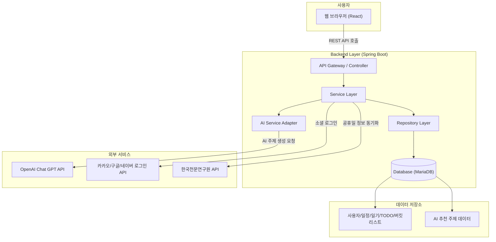

# TropiCal : AI 기반 스몰토크 추천 플랫폼

  

<b>TropiCal - 일상을 대화로 연결하는 AI 캘린더</b>

사용자의 일정, 일기, 할 일, 버킷리스트를 분석하여 맞춤형 스몰토크 주제를 추천하는 대화 불안 해소 플랫폼

  <b>TEAM</b> Aicemelt

---

## 목차

- [프로젝트 정보](#프로젝트-정보)
- [Getting Started](#getting-started)
- [프로젝트 비전](#프로젝트-비전)
    - [TropiCal이 해결하는 문제](#tropical이-해결하는-문제)
    - [TropiCal의 철학](#tropical의-철학)
    - [플랫폼 차별성](#플랫폼-차별성)
- [주요 기능](#주요-기능)
- [사용자 페르소나](#사용자-페르소나)
- [팀 구성](#팀-구성)
- [개발 기간](#개발-기간)
- [기술 스택](#기술-스택)
- [시스템 아키텍처](#시스템-아키텍처)
- [대표 문서](#대표-문서)
    - [전체 문서 폴더](#전체-문서-폴더)
    - [협업 규칙 & 기여 문서](#협업-규칙--기여-문서)
- [향후 업데이트 계획](#향후-업데이트-계획)
- [문의](#문의)

---

## 프로젝트 정보

| 항목           | 내용                                                                       |
| ------------ | ------------------------------------------------------------------------ |
| **팀명**       | **Aicemelt** — *AI와 사람의 자연스러운 소통을 연결하는 팀* |
| **프로젝트명**    | **WarmUpdate** — *팀 Aicemelt가 추진하는 대화 불안 해소 프로젝트*         |
| **플랫폼명**     | **TropiCal** — *Tropical + Calendar. 차갑고 어색한 분위기를 따뜻하게 녹여내는 AI 기반 대화 캘린더*    |
| **버전**       | v1.1                                                                   |
| **Base URL** | `http://localhost:9005/` (Backend), `http://localhost:5005` (Frontend)                                                |

---

## Getting Started

- [백엔드 설치 및 실행 가이드](https://github.com/Aicemelt/Tropical-docs/blob/main/04_Guides/setup/Backend_project_Guide.md)
- [프론트엔드 설치 및 실행 가이드](https://github.com/Aicemelt/Tropical-docs/blob/main/04_Guides/setup/Frontend_project_Guide.md)
- [API 스펙 명세서](https://github.com/Aicemelt/Tropical-docs/blob/main/03_Specifications/TropiCal%20-%20API%20%EB%AA%85%EC%84%B8%EC%84%9C.md)
- [시스템 아키텍처](https://github.com/Aicemelt/Tropical-docs/blob/main/02_Architecture/TropiCal%20%EC%8B%9C%EC%8A%A4%ED%85%9C%20%EC%95%84%ED%82%A4%ED%85%8D%EC%B2%98.md)

---

## 프로젝트 비전

TropiCal은 단순한 캘린더 앱이 아니라, **대화 불안을 해결하고 자연스러운 소통을 돕는 AI 기반 플랫폼**입니다.

### TropiCal이 해결하는 문제

- **대화 시작의 어려움**: 무슨 말을 먼저 꺼내야 할지 몰라 침묵이 흐를 때의 불안과 스트레스
- **개인적 소재 부족**: 회사 이야기 외에는 어떤 주제로 대화를 이끌어가야 할지 막막함
- **상황별 대화 주제**: 일상 속 다양한 상황에서 자연스럽고 개인적인 대화를 시작할 수 있는 소재 필요

### TropiCal의 철학

* **Schedule → Conversation 철학**:

  단순 일정 관리를 넘어, 일정 맥락을 기반으로 한 대화 주제 추천에 초점을 둡니다. 사용자의 일상이 자연스러운 대화 소재로 변환됩니다.

* **Context-Aware 철학**:

  '언제/어디서/누구와/무엇을'과 같은 맥락을 파악하여 주제 카드와 예시 문장을 맞춤형으로 제공합니다.

* **Safe & Harmless 철학**:

  민감하거나 갈등을 유발할 수 있는 주제를 감지하고 안전한 대체 문장을 제안합니다.

* **Personalized Coaching 철학**:

  사용자의 톤, 길이, 관심사를 반영한 맞춤형 대화 코칭을 제공합니다.

* **동의 기반 개인화 철학**:

  사용자가 동의한 범위 내에서만 개인 데이터를 활용하여 AI 추천의 개인화 수준을 조정합니다.

### 플랫폼 차별성

TropiCal의 목표는 "일정과 대화를 연결하는 안전한 대화 캘린더"입니다.

| 구분         | 기존 캘린더 앱      | **TropiCal**                        |
| ---------- | --------------- | -------------------------------- |
| **핵심 경험**  | 일정 관리 중심 | **일정 → 대화 주제** 연결         |
| **AI 역할** | 일정 알림 수준     | **맥락 이해 + 개인화 추천 + 대화 코칭**      |
| **데이터 활용**  | 일정 정보만 활용    | **일정 + 일기 + TODO + 버킷리스트** 통합 분석 |
| **개인정보 보호** | 일괄 수집       | **동의 기반 선택적** 개인화 |
| **사용자 경험** | 정보 관리 도구       | **대화 불안 해소**를 위한 코칭 플랫폼    |

> TropiCal은 캘린더를 넘어, **누구나 자연스럽고 안전하게 말문을 여는 세상**을 만드는 데 집중합니다.

---

## 주요 기능

### 캘린더 및 일정 관리
- **월별/날짜별 캘린더 뷰**: 직관적인 일정 관리 인터페이스
- **일정 CRUD**: 생성, 조회, 수정, 삭제
- **공휴일 연동**: 한국천문연구원 API 기반 공휴일 정보 표시
- **일정 속성**: 날짜, 시간, 제목, 장소, 참여자, 메모, 완료 여부

### 개인 기록 관리
- **일기 관리**: 감정과 날씨 정보를 포함한 일기 작성
- **할 일 관리**: 마감 기한과 우선순위 기반 TODO 리스트
- **버킷리스트**: 장기적인 목표와 꿈 관리

### AI 스몰토크 주제 추천 (핵심 기능)
- **개인화 추천**: 사용자의 일정, 일기, 할 일, 버킷리스트 데이터 분석
- **5가지 주제 유형**: 일상적, 관심사, 생각거리, 창의적, 복합 주제
- **예시 질문 제공**: 각 주제별 대화 시작 문장 제안
- **중복 방지**: 코사인 유사도 기반 중복 주제 필터링
- **동의 기반**: 사용자 동의 범위에 따른 개인화 수준 조정

### 개인 설정 및 보안
- **회원가입**: 로컬 계정 및 소셜 로그인 (카카오, 구글, 네이버)
- **온보딩**: 필수/선택 약관 동의 시스템
- **개인화 설정**: 캘린더 시작 요일, 시간대, 알림 설정
- **개인정보 보호**: 마스킹 처리 및 동의 기반 데이터 활용

---

## 사용자 페르소나

### 주요 타겟

| 페르소나 | 연령/직업 | 주요 니즈 | 사용 시나리오 |
|---------|-----------|----------|---------------|
| **사회초년생 이지은** | 25세, 신입사원 | 동료들과의 자연스러운 스몰토크 | 팀 미팅 전후 대화 주제 확보 |
| **취업준비생 김민준** | 27세, 구직자 | 스터디 모임에서의 대화 시작 | 면접 준비와 스터디 활동 기반 대화 |
| **직장인 박서연** | 31세, 회사원 | 동호회에서의 취미 대화 | 버킷리스트와 여가 활동 기반 대화 |
| **학생 백승현** | 33세, 대학생 | 서비스 체험 및 가치 판단 | 개인정보 입력 없이 기본 기능 경험 |

---

## 팀 구성

| 역할 | 이름                                     | 주요 담당 기능                                                                                   | 회고록 링크                                                                                                             |
| -- | -------------------------------------- |-------------------------------------------------------------------------------------------------| ------------------------------------------------------------------------------------------------------------------ |
| 팀장 | [백승현](https://github.com/Sirosho)        |  |  |
| 팀원 | [진도희](https://github.com/dohee-jin)          |  |  |
| 팀원 | [신동준](https://github.com/sdj3959)        |  |  |
| 팀원 | [왕택준](https://github.com/TJK98)        |  |  |

---

## 개발 기간

**2025.09.08 ~ 2025.09.23**

| **Phase**                          | **기간**         | **주요 내용**                               |
| ---------------------------------- | -------------- | --------------------------------------- |
| **Phase 1. Planning**              | 09.08 \~ 09.11 | 기획, 초기 설계, DB 모델링, 요구사항 명세                       |
| **Phase 2. Development**           | 09.12 \~ 09.15 | 핵심 기능 개발, AI API 연동, 백엔드 구축                        |
| **Phase 3. Frontend Build**        | 09.16 \~ 09.21 | 프론트엔드 구현 (React, API 연결, UI/UX 개선) |
| **Phase 4. Integration & Testing** | 09.21 \~ 09.22 | 통합 테스트, 버그 수정, 성능 최적화                   |
| **Phase 5. Documentation**         | 09.21 \~ 09.23 | 문서 정리 및 발표 자료 작성                             |

---

## 기술 스택

| 구분 | 기술 |
|------|------|
| **언어** |   |
| **프레임워크** |   |
| **프론트엔드** |     |
| **상태 관리** |  |
| **라우팅** |  |
| **HTTP 클라이언트** |  |
| **보안/인증** |    |
| **AI 연동** |   |
| **데이터베이스** |    |
| **메일링** |  |
| **환경 변수** |  |
| **외부 API** |   |
| **빌드/의존성 관리** |   |
| **테스트** |   |
| **테스트 환경** |   |
| **API 문서** |  |
| **협업 도구** |    |
| **개발 환경** |     |
---

## 시스템 아키텍처

### 전체 아키텍처 개요

### 주요 데이터 흐름

1. **AI 스몰토크 주제 생성**
   - 데이터 수집: 사용자의 최근 7일간 활동 데이터(일기, 일정, 투두리스트, 버킷리스트)
   - 프롬프트 생성: 수집된 데이터를 바탕으로 AI 프롬프트 구성
   - API 호출: OpenAI GPT API 호출하여 5개 주제 생성
   - 중복 검사: 기존 주제와 코사인 유사도 계산 - [중복 검사 로직 가이드](https://github.com/Aicemelt/Tropical-docs/blob/main/04_Guides/technical/SmalltalkAI_DuplicatePrevention_Guide.md)
   - 저장: 검증된 주제를 DB에 저장

2. **동의 기반 개인화**
   - 필수 동의: 일정 기반 추천 (서비스 이용 필수)
   - 선택 동의: 일기/할일/버킷리스트 기반 추천
   - 동의 범위에 따라 AI 개인화 수준 조정

---

## 대표 문서

### 기획 및 요구사항
- [프로젝트 개요](https://github.com/Aicemelt/Tropical-docs/blob/main/01_Planning/WarmUpDate%20-%20%ED%94%84%EB%A1%9C%EC%A0%9D%ED%8A%B8%20%EA%B0%9C%EC%9A%94.md)
- [사용자 스토리 및 요구사항 명세서](https://github.com/Aicemelt/Tropical-docs/blob/main/01_Planning/TropiCal_%EC%82%AC%EC%9A%A9%EC%9E%90%EC%8A%A4%ED%86%A0%EB%A6%AC%20%EB%B0%8F%20%EC%9A%94%EA%B5%AC%EC%82%AC%ED%95%AD%EB%AA%85%EC%84%B8%EC%84%9C.md)

### 시스템 설계 및 명세
- [시스템 아키텍처](https://github.com/Aicemelt/Tropical-docs/blob/main/02_Architecture/TropiCal%20%EC%8B%9C%EC%8A%A4%ED%85%9C%20%EC%95%84%ED%82%A4%ED%85%8D%EC%B2%98.md)

- [개념 ERD 명세서](https://github.com/Aicemelt/Tropical-docs/blob/main/02_Architecture/TropiCal%20-%20%EA%B0%9C%EB%85%90%20ERD%20%EB%AA%85%EC%84%B8%EC%84%9C.md)
- [논리 ERD 명세서](https://github.com/Aicemelt/Tropical-docs/blob/main/02_Architecture/TropiCal%20-%20%EB%85%BC%EB%A6%AC%20ERD%20%EB%AA%85%EC%84%B8%EC%84%9C.md)

- [API 명세서](https://github.com/Aicemelt/Tropical-docs/blob/main/03_Specifications/TropiCal%20-%20API%20%EB%AA%85%EC%84%B8%EC%84%9C.md)
- [사용자 흐름 기반 기능명세서](https://github.com/Aicemelt/Tropical-docs/blob/main/03_Specifications/TropiCal%20-%20%EC%82%AC%EC%9A%A9%EC%9E%90%ED%9D%90%EB%A6%84%20%EA%B8%B0%EB%B0%98%20%EA%B8%B0%EB%8A%A5%EB%AA%85%EC%84%B8%EC%84%9C.md)

### 개발 가이드
- [백엔드 프로젝트 가이드](https://github.com/Aicemelt/Tropical-docs/blob/main/04_Guides/setup/Backend_project_Guide.md)

- [프론트엔드 프로젝트 가이드](https://github.com/Aicemelt/Tropical-docs/blob/main/04_Guides/setup/Frontend_project_Guide.md)

- [JWT 키 생성 가이드](https://github.com/Aicemelt/Tropical-docs/blob/main/04_Guides/setup/generate_JWT_KEY_OpenSSL.md)

- [AI 주제 추천 중복 방지 로직 가이드](https://github.com/Aicemelt/Tropical-docs/blob/main/04_Guides/technical/SmalltalkAI_DuplicatePrevention_Guide.md)

### 정책 및 약관
- [AI 추천 서비스 정책](https://github.com/Aicemelt/Tropical-docs/blob/main/05_Policies/TropiCal%20-%20AI%EC%B6%94%EC%B2%9C%EC%84%9C%EB%B9%84%EC%8A%A4%EC%A0%95%EC%B1%85.md)

- [개인정보처리방침](https://github.com/Aicemelt/Tropical-docs/blob/main/05_Policies/TropiCal%20-%20%EA%B0%9C%EC%9D%B8%EC%A0%95%EB%B3%B4%EC%B2%98%EB%A6%AC%EB%B0%A9%EC%B9%A8.md)
- [서비스 이용약관](https://github.com/Aicemelt/Tropical-docs/blob/main/05_Policies/TropiCal%20-%20%EC%84%9C%EB%B9%84%EC%8A%A4%20%EC%9D%B4%EC%9A%A9%EC%95%BD%EA%B4%80.md)

### 전체 문서 폴더

- [01_Planning](https://github.com/Aicemelt/Tropical-docs/tree/main/01_Planning) - 프로젝트 기획 문서
- [02_Architecture](https://github.com/Aicemelt/Tropical-docs/tree/main/02_Architecture) - 시스템 아키텍처 및 설계 문서
- [03_Specifications](https://github.com/Aicemelt/Tropical-docs/tree/main/03_Specifications) - 프로젝트 세부 스펙 문서
- [04_Guides](https://github.com/Aicemelt/Tropical-docs/tree/main/04_Guides) - 프로젝트 내부 규칙 문서와 개발 가이드 문서
- [05_Policies](https://github.com/Aicemelt/Tropical-docs/tree/main/05_Policies) - 프로젝트 정책 관련 문서
- [06_meeting-notes](https://github.com/Aicemelt/Tropical-docs/tree/main/06_meeting-notes) - 프로젝트 회의록
- [assets](https://github.com/Aicemelt/Tropical-docs/tree/main/assets) - 이미지, 다이어그램

### 협업 규칙 & 기여 문서

- [문서 버전 관리 규칙](https://github.com/Aicemelt/Tropical-docs/blob/main/04_Guides/collaboration/doc-versioning-rules.md)
- [Git 워크플로우 규칙](https://github.com/Aicemelt/Tropical-docs/blob/main/04_Guides/collaboration/git-workflow.md)

---

## 향후 업데이트 계획

### Phase 1 (v1.2.0) — 기능 개선

* **AI 품질 고도화**
    * 톤/길이 옵션 (격식/친근, 짧게/보통)
    * 대화 스타일 학습 및 개인화 강화
    * 더 정교한 맥락 이해 및 주제 생성

* **사용자 경험 개선**
    * 다크 모드 지원
    * 반복 일정 관리
    * 외부 캘린더 연동 (구글, 네이버)

* **알림 시스템 강화**
    * 실시간 WebSocket 기반 알림
    * 스몰토크 주제 푸시 알림
    * 일정 및 할 일 스마트 알림

### Phase 2 (v1.3.0) — 기능 확장

* **소셜 기능**
    * 스몰토크 주제 공유
    * 팀/커뮤니티 대화 주제 추천
    * 공개 버킷리스트 및 동기부여 커뮤니티

* **고급 분석**
    * 대화 패턴 분석 및 리포트
    * 개인 성장 트래킹
    * 목표 달성률 시각화

* **멀티 플랫폼**
    * 모바일 앱 (iOS/Android)
    * 웨어러블 연동
    * 음성 입력/출력 기능

### Phase 3 (v2.0.0) — 수익화 및 확장

* **수익 모델**
    * 프리미엄 구독제 (무제한 AI 추천, 고급 기능)
    * 광고 기반 무료 서비스

* **AI 고도화**
    * 다국어 지원
    * 문화적 맥락 이해
    * 산업별/직군별 특화 대화 주제

* **클라우드 네이티브**
    * AWS 기반 마이크로서비스 아키텍처
    * 자동 스케일링 및 로드 밸런싱
    * 글로벌 CDN 배포

---

## 문의

> 궁금한 점은 언제든 GitHub Issue를 통해 문의 바랍니다.

**문의:** GitHub Issues 또는 Pull Request

**프로젝트 관리:** [Team Aicemelt](https://github.com/Aicemelt)